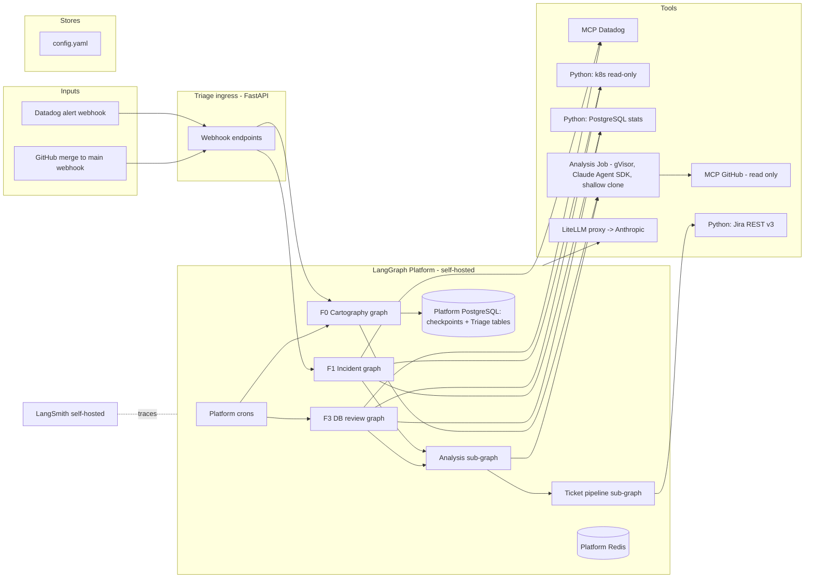

# Triage — Architecture v0

Status: v0, with every item that was marked open now resolved by an ADR in [`adr/`](adr/).
Decisions recorded there as *Proposed* were taken to unblock work and are cheap to reverse;
each one records what would make it wrong.

For what is actually built today, see [§10 Implementation status](#10-implementation-status).

## Decisions taken so far

| Topic | Decision |
|---|---|
| Orchestration | LangGraph, composed sub-graphs; two shared sub-graphs: Analysis and Ticket pipeline |
| LLM access | LiteLLM, Anthropic models only |
| Model tiers | Haiku = triage/routing, Sonnet = analysis, Opus = diagnosis |
| Execution | Graphs run on self-hosted LangGraph Platform (in the prod cluster); Triage ingress = thin FastAPI service for webhooks, invoking graphs via the Platform API |
| State | LangGraph Platform's PostgreSQL for everything: checkpoints (managed by the Platform) and Triage tables |
| Signal ingestion | Webhooks (Datadog, GitHub) via the ingress; DB review and F0 refresh as Platform crons |
| External systems | MCP servers when they exist, Python tools otherwise; Jira has no MCP server, so REST v3 ([ADR-0013](adr/0013-jira-over-rest.md)) |
| Code / Terraform analysis | A gVisor Kubernetes Job per analysis; F0 summaries are a bounded context gather plus one structured call ([ADR-0014](adr/0014-analysis-entrypoint-context-gather.md)) |
| Git access | No shared cache: each analysis Job clones the repo at the required commit |
| Configuration | YAML for static config; PostgreSQL for what F0 discovers |
| Observability of Triage | LangSmith self-hosted |
| Concurrency / scheduling | Platform task queue for concurrency; Platform crons for scheduling (APScheduler removed) |
| Jira "Validated" | Ticket enters the team backlog; no automated action |
| Analysis isolation | Sandbox (gVisor or equivalent) per run, read-only |

---

## 1. High-level view



Execution: the ingress only validates webhooks and creates runs on the Platform (one thread per signal). Concurrency is the Platform's task queue; 2 workers, queue concurrency 4 ([ADR-0001](adr/0001-platform-worker-count.md)). Scheduling: Platform crons create runs for the F3 daily tick and F0 periodic refresh. The Platform also handles retries and run history; LangSmith self-hosted receives all traces.

---

## 2. Graphs

### 2.1 Analysis sub-graph (shared)

Input: a `Hypothesis` list (ranked causes, each typed app / infra / deployment / dependency, with the service and commit concerned). Output: a `Diagnosis` object (see §4).

```
hypotheses_in
  → fan-out on the top 3 hypotheses with rank_score >= 0.3 (ADR-0005)
      ├─ app        → code_analysis      (analysis Job: clone at deployed commit)
      ├─ infra      → iac_analysis       (analysis Job: clone Terraform repo)
      ├─ deployment → diff_analysis      (analysis Job: clone both commits, diff)
      └─ dependency → dependency_report  (no code analysis)
  → diagnose           (Opus: synthesize into Diagnosis)
```

Used by F1 (after qualification) and F3 (one `app` hypothesis per slow query, to locate the calling code).

### 2.2 Ticket pipeline (shared sub-graph)

Input: a `Diagnosis` object (see §4). Output: a Jira ticket in state `Proposed by agent`, or a Slack-only notice.

```
diagnosis_in
  → dedup_check        (Haiku: compare with open tickets / incident memory)
  → confidence_gate    (rule, no LLM)
      ├─ below threshold → slack_notice → END
      └─ above → compose_ticket   (Sonnet: fill the developable-ticket spec)
               → self_review      (Opus: "could a developer start on this without a question?")
                    ├─ no  → compose_ticket (max N loops)
                    └─ yes → create_jira → notify_slack → END
```

Confidence threshold: per feature, set in `config.yaml`. Confidence is a three-level enum;
F1 requires `medium`, F3 requires `high` ([ADR-0002](adr/0002-confidence-thresholds.md)).
Compose/review loop: max 3; on the 3rd failure → Slack notice with the draft attached.
`dedup_check` match → update the existing ticket: append new evidence, increment an occurrence
counter, and post to Slack. The notice escalates at the 3rd occurrence, then every 5th
([ADR-0003](adr/0003-recurrence-alerting.md)). A ticket key the model was not shown is discarded.

### 2.3 F1 — Incident graph

```
alert_in
  → classify_alert     (Haiku: alert type → collection window + which collectors)
  → fetch_bits_ai      (Datadog Bits AI investigation — always available, primary input)
  → collect_gaps       (only what Bits AI did not cover: k8s events, extra traces)
  → qualify            (Sonnet: ranked Hypothesis list)
  → [Analysis sub-graph]
  → [Ticket pipeline]
  → postmortem_draft   (Sonnet)
```

Bits AI is the primary telemetry input; Triage adds code/IaC reasoning on top. If it is
unavailable: one retry, then collect alone, record the gap in `unknowns` and cap confidence at
`medium` ([ADR-0004](adr/0004-bits-ai-unavailable.md)).

### 2.4 F3 — DB review graph

```
daily_tick
  → collect_db_stats     (Python: pg_stat_statements, vacuum, bloat, locks, connections)
  → diff_vs_yesterday    (rule)
  → [Analysis sub-graph]  (one `app` hypothesis per top query → calling code, per-query Diagnosis)
  → report               (Opus: global report, changes + open items, selects significant recommendations)
  → for each significant recommendation → [Ticket pipeline]
  → slack_report
```

Target databases are declared in `config.yaml`, each naming a Kubernetes Secret; the role has
`pg_read_all_stats` and no table-level `SELECT` ([ADR-0008](adr/0008-f3-database-access.md)).

### 2.5 F0 — Cartography graph

```
repo_list (YAML) or merge_webhook
  → summarize_repo       (analysis Job: clone main → structured summary per repo)
  → summarize_terraform  (analysis Job: clone → resources, modules ↔ services)
  → build_system_map     (rule: merge summaries + YAML ownership)
  → persist_map          (PostgreSQL)
```

Incremental on every merge, with a weekly full re-summarise by cron
([ADR-0006](adr/0006-f0-refresh-strategy.md)).

`build_system_map` is a rule, not a model call as first sketched: a summary names the
service it deploys as, a module names the services it provisions for, and `config.yaml`
names the owner, so the merge is a join over structured data. The one fuzzy part — a
resource's free-text `serves` — is matched by service name and left empty when it does
not match. A service whose team is undeclared is persisted with no owner and reported to
the platform channel, alongside any repository that failed to summarise.


---

## 3. Model routing via LiteLLM

| Tier | Model | Used for |
|---|---|---|
| triage | Haiku | classify_alert, dedup_check, routing |
| analysis | Sonnet | qualify, compose_ticket, postmortem |
| diagnosis | Opus | diagnose, self_review, report |

LiteLLM config exposes three aliases (`triage`, `analysis`, `diagnosis`) so graph code never references a model name directly.

Analysis Jobs: the `analysis` tier for all analysis (F0, F1, F3). One runs in a Kubernetes Job (gVisor runtime class) launched by the graph node; the Job shallow-clones the repo at the required commit, runs the analysis entrypoint, returns a structured result, and is deleted. Nothing persists between Jobs.

The F0 summarisation kinds do not run an agent inside the Job. The entrypoint walks the clone, reads the files that decide the answer in priority order until a byte budget is spent, lists back what it did not read, and makes one structured call — testable offline, with a cost known before the run ([ADR-0014](adr/0014-analysis-entrypoint-context-gather.md)). The investigative kinds M3 adds may choose differently: following a reference is worth more when the question is specific.
Budget guardrails enforced by the LiteLLM proxy: 500 k tokens per run **and** $50 per day
([ADR-0007](adr/0007-model-tiers-and-budgets.md)). Structured output uses tool calling, not
`response_format`, since every model behind the proxy is an Anthropic one.

---

## 4. Core data model (Platform PostgreSQL, dedicated `triage` schema)

- `system_map` — services, repos, owners, dependencies, terraform resources (from F0).
- `signals` — every ingested alert / db tick, raw payload, status.
- `diagnoses` — structured output of F1/F3 before ticketing.
- `tickets` — Jira key, state mirror, linked signal and diagnosis.
- `evaluations` — per ticket: validated?, time-to-ticket, reviewer feedback at validation and closure (from Jira webhook).
- Checkpoint, thread and run tables — managed by the Platform, never touched by Triage.

`Hypothesis` schema (Pydantic): cause_type (app/infra/deployment/dependency), service, commit, description, rank_score.

`Diagnosis` schema (Pydantic) mirrors the developable-ticket spec: symptom, impact, probable_cause, confidence, evidence[], location, expected_change, out_of_scope, ruled_out[], unknowns[].

---

## 5. Tools layer

| System | Access | Read/Write |
|---|---|---|
| Datadog | MCP | read |
| Kubernetes | Python (read-only ServiceAccount) | read |
| PostgreSQL (target DBs) | Python (read-only role) | read |
| GitHub | MCP | read |
| Jira | Python (REST v3, `httpx`) | read + write |
| Slack | Python SDK (slack_sdk) | write |
| Code | Claude Agent SDK in analysis Job (shallow clone) | read |

---

## 6. Configuration

`config.yaml` (versioned):
```yaml
teams:
  - name: payments
    slack_channel: "#payments-alerts"
    jira_project: PAY
repos:
  - url: github.com/org/payments-api
    team: payments
    kind: application
  - url: github.com/org/infra
    team: platform
    kind: terraform
thresholds:
  ticket_confidence:
    F1: medium
    F3: high
  dedup_recurrence_alert: 3
  dedup_recurrence_interval: 5
```

Discovered data (system map) lives in PostgreSQL and is never hand-edited.

---

## 7. Security boundaries

- Triage runs with read-only credentials on every production system.
- GitHub token scoped to read-only (repos, commits).
- Jira token scoped to the configured projects.
- Each analysis runs in a throwaway gVisor Job with a fresh clone. Network limited to GitHub (clone) and the LiteLLM proxy. Git credential injected as a read-only token; the Job never pushes.
- Graph → Job contract: input as a ConfigMap/JSON; output written to the `triage.analysis_results`
  table with a narrow insert-only role ([ADR-0009](adr/0009-analysis-job-result-channel.md)).
  Job timeout 15 min, clone depth 1.
- Secrets: Kubernetes Secrets, mounted as env vars; one Secret per external system.

---

## 8. Deployment

Everything runs in the production cluster, namespace `triage`, with a read-only ServiceAccount and NetworkPolicy.

Components:
- `langgraph-platform` — self-hosted (API server, workers, its PostgreSQL and Redis). Hosts all graphs and crons. Needs an Enterprise licence, treated as a
  procurement dependency with a documented in-process fallback
  ([ADR-0011](adr/0011-langgraph-platform-licence.md)). Worker count per ADR-0001.
- `triage-ingress` — thin FastAPI deployment: Datadog, GitHub and Jira (closure feedback) webhook validation, run creation on the Platform. No business logic.
- `litellm-proxy` — holds the Anthropic key, enforces budgets, centralises logs; aliases `triage` / `analysis` / `diagnosis`.
- `analysis-job` template — gVisor runtime class, Claude Agent SDK image; one Job per analysis, created by graph nodes through the Kubernetes API (the Platform's ServiceAccount needs create/get/delete on Jobs in the `triage` namespace only).
- `langsmith` — self-hosted, receives traces from the Platform.

Triage tables live in the Platform's PostgreSQL under a dedicated schema, with migrations owned by Triage.

---

## 9. Decisions taken, with their ADRs

Every item that was open in the first draft now has a decision. The ADRs carry the
reasoning and, more usefully, the condition that would make each one wrong.

| # | Decision | ADR |
|---|---|---|
| 1 | 2 Platform workers, queue concurrency 4 | [0001](adr/0001-platform-worker-count.md) |
| 2 | Confidence is `low`/`medium`/`high`; F1 ≥ medium, F3 ≥ high | [0002](adr/0002-confidence-thresholds.md) |
| 3 | Every dedup match is announced; escalate at the 3rd occurrence, then every 5th | [0003](adr/0003-recurrence-alerting.md) |
| 4 | Bits AI down → degrade, never wait; cap confidence at medium | [0004](adr/0004-bits-ai-unavailable.md) |
| 5 | Analyse the top 3 hypotheses with rank_score ≥ 0.3, always at least 1 | [0005](adr/0005-secondary-cause-fanout.md) |
| 6 | F0 incremental per merge, full re-summarise weekly | [0006](adr/0006-f0-refresh-strategy.md) |
| 7 | Tier aliases only; 500 k tokens per run and $50/day, both | [0007](adr/0007-model-tiers-and-budgets.md) |
| 8 | Databases declared in config, Secret refs, `pg_read_all_stats` only | [0008](adr/0008-f3-database-access.md) |
| 9 | Jobs return results via `triage.analysis_results`; 15 min, depth 1 | [0009](adr/0009-analysis-job-result-channel.md) |
| 10 | Post-mortem draft as a Jira comment, linked from Slack | [0010](adr/0010-postmortem-destination.md) |
| 11 | Platform Enterprise licence, with an in-process fallback | [0011](adr/0011-langgraph-platform-licence.md) |
| 12 | Nightly full dump, 30 d; payloads 90 d; product memory kept | [0012](adr/0012-backup-and-retention.md) |

---

## 10. Implementation status

| Milestone | Scope | State |
|---|---|---|
| M0 | Repo, schemas, config, model tiers, persistence, migrations, CI | **Done** |
| M1 | Ticket pipeline sub-graph (§2.2), end to end against fixtures | **Done** |
| M2 | F0 cartography, analysis Job contract and gVisor template, `system_map` | Not started |
| M3 | Analysis sub-graph (§2.1), F1 incident graph (§2.3), Datadog ingress | Not started |
| M4 | F3 daily database review (§2.4) | Not started |
| M5 | Alert coverage audit, self-evaluation reporting, incident memory | Not started |
| Infra | Self-hosted Platform, LiteLLM proxy, LangSmith, NetworkPolicies, backups | Not started |

What exists today is the shared ticket pipeline and everything underneath it. It is
built and tested standalone, driven by fixture `Diagnosis` objects, so the product
definition can be validated before any collector exists — which is the roadmap's own
delivery order.

The tables in §4 are all migrated, including those M2–M4 will fill. The tools in §5
are protocols with fakes; only Jira and Slack have real implementations, and the
Jira one is unverified against a live server (see its module docstring).

Not yet built, and worth stating plainly: the ingress service, every collector, the
Analysis sub-graph, the analysis Job image and template, and the whole infra track.
